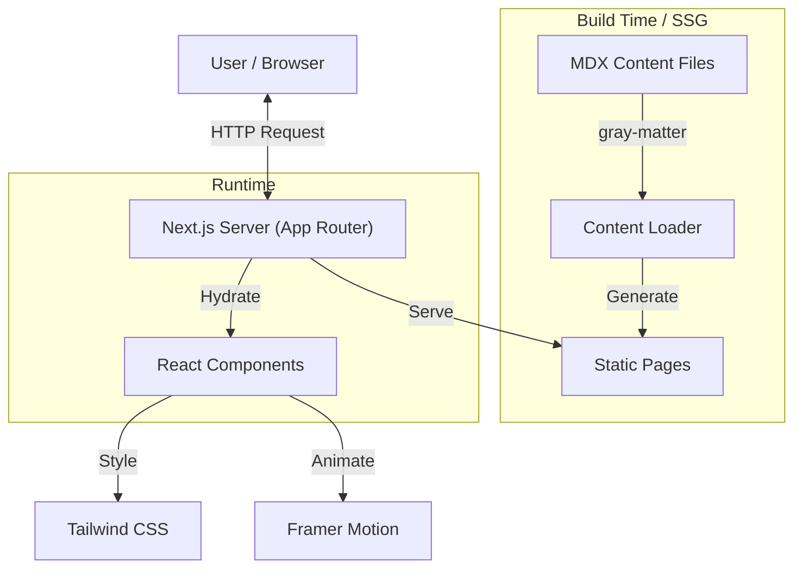

# Niles Lutz - SAP Solution Architect Portfolio

Production-ready personal website built with Next.js 16, Tailwind CSS 4, and Framer Motion.
Designed for high performance, clean aesthetics ("Nordic Clean"), and maintainability.

## 🚀 Technologies

- **Framework**: [Next.js 16 (App Router)](https://nextjs.org)
- **Styling**: [Tailwind CSS 4](https://tailwindcss.com) + `clsx` + `tailwind-merge`
- **Content**: MDX (via `next-mdx-remote/rsc`) + `gray-matter` for frontmatter.
- **Animation**: `framer-motion`
- **Theming**: `next-themes` (Dark/Light mode)
- **Tooling**: Prettier, ESLint

## 📐 Architecture



## 🛠️ Setup & Development

```bash
# Install dependencies
npm install

# Run development server
npm run dev

# Build for production
npm run build

# Start production server
npm start
```

## 📝 Content Management

Content is managed via Markdown/MDX files in the `content/` directory.

### Profile

Edit `content/profile.ts` for:

- Name, Role, Bio
- Social Links
- CTA texts

### Case Studies

Add `.mdx` files to `content/case-studies/`.
Required Frontmatter:

```yaml
---
title: 'Project Title'
summary: 'Short description...'
tags: ['CAP', 'BTP', 'Architecture']
period: '2024'
role: 'Solution Architect'
stack: ['Node.js', 'HANA']
featured: true
metrics: ['-30% Costs']
---
```

### Notes (Blog)

Add `.mdx` files to `content/notes/`.
Required Frontmatter:

```yaml
---
title: 'Article Title'
summary: 'Teaser...'
date: '2024-03-20'
tags: ['Architecture']
---
```

## 🏗️ Architecture Decisions (ADR-light)

1.  **MDX over CMS**: For a developer portfolio, "Content as Code" is superior. No external dependencies, easy versioning in Git.
2.  **Tailwind CSS 4**: Used the latest version for better performance (CSS-first config) and future-proofing.
3.  **Client-Side Filtering**: List of case studies is filtered client-side (`<CaseStudyList>`) for instant feedback. The data set is small enough (< 100 items).
4.  **Component Architecture**: clearly separated into `components/ui` (reusable, generic) and `components/specialized` (domain-specific, non-reusable).
5.  **Inter Font**: Self-hosted via `next/font` for privacy and performance (no Google Fonts network requests).

## License

MIT
