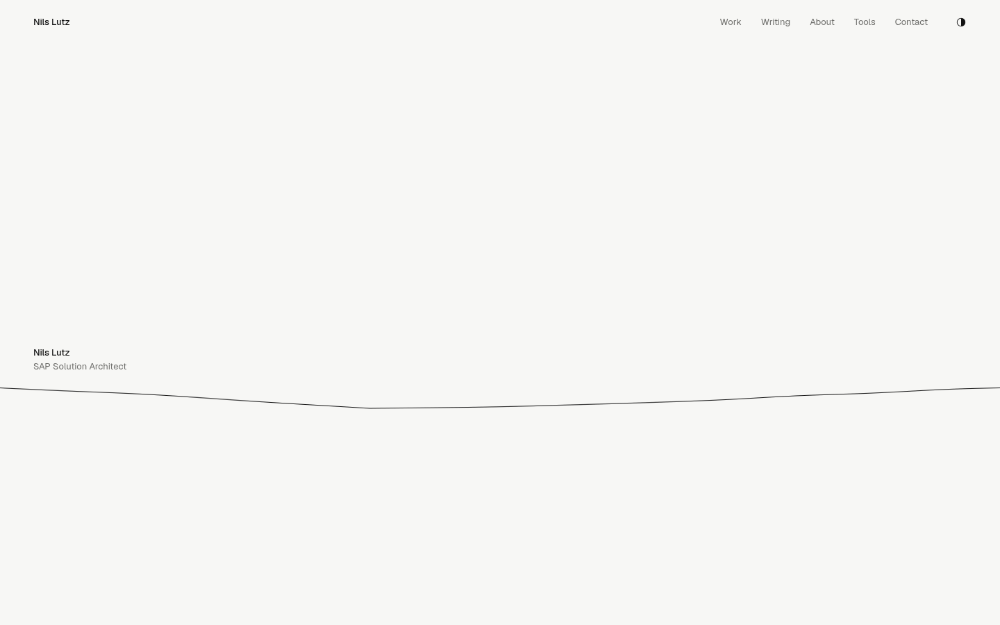
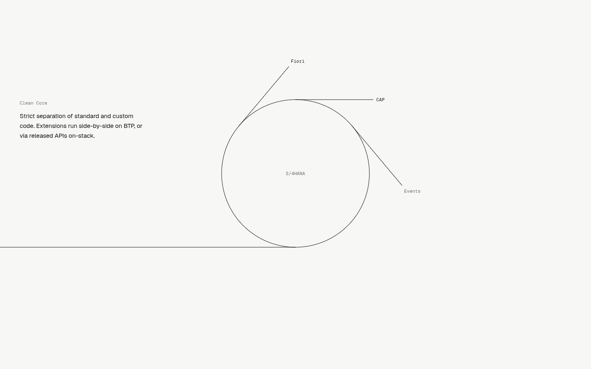
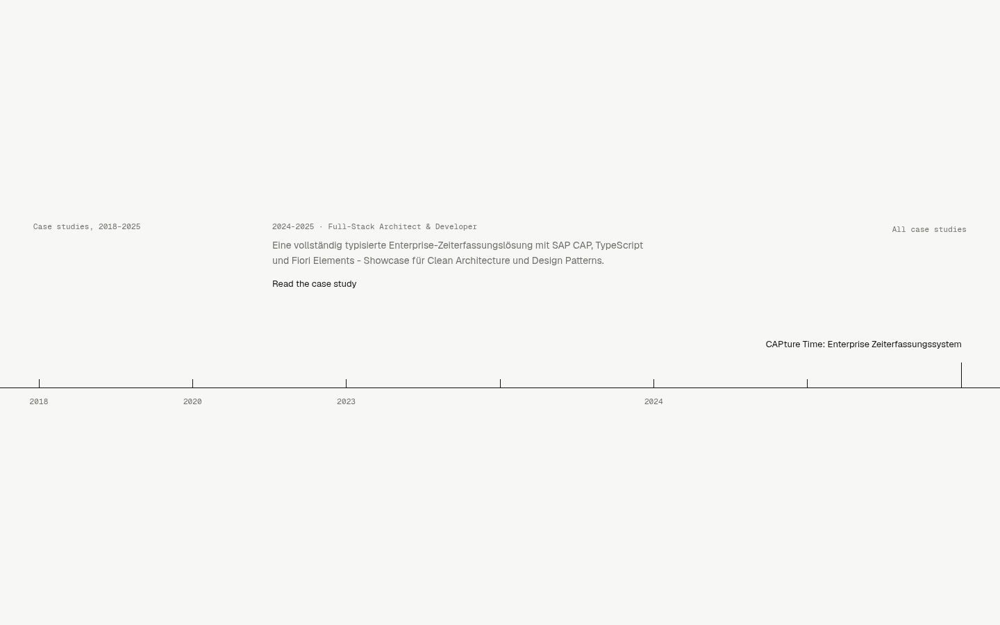
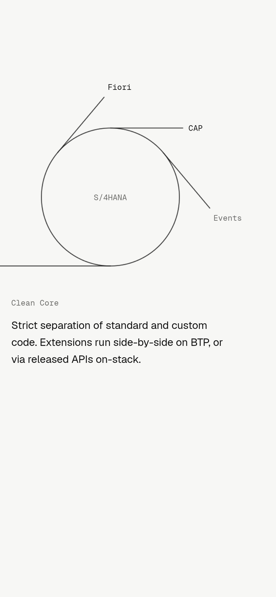

# Line — redesign proposal

> Almost everything is whitespace. One hairline carries the whole page.

## Concept & mood

Radical minimalism: near-white paper (`#f7f7f5`) and near-black ink (`#111`), no accent colour.
Dark mode is the exact inversion of every token (`#08080a` / `#eeeeee`). One signal dot (`#ff3b00`)
appears exactly once per page: on the home page it is the point the line ends in, on /contact it
marks availability. No cards, no shadows, no gradients, no icons (the theme toggle is a half-filled
disc that turns over — the only glyph on the site). Hairlines instead of boxes.

## Type

One family: **Geist** + **Geist Mono** (via `next/font`). Small sizes (13–15px UI, 16–17px prose),
generous leading, `tabular-nums` for every year and date, `text-wrap: balance` on headings,
`pretty` on paragraphs. Mono is used only for labels (dates, periods, section labels).
Strict grid: 4 columns on desktop, 2 on phones; the first column holds labels, the rest content.

## The memorable thing

A single full-width hairline rendered in WebGL (Three.js). It is a real string:

- A 1D damped wave-equation simulation (CPU, 320 nodes desktop / 160 mobile, CFL-stable
  symplectic Euler) with uniform damping plus harmonic-dependent (viscous) damping, so the bright
  kink of a pluck melts within a few periods while the fundamental rings on.
- Moving the cursor across the line catches it; it follows the pointer and snaps free at ~44px —
  a triangular pluck with all its harmonics (Helmholtz motion is visible for a few frames).
  On touch, a thin band over the hero line lets a finger catch and pluck it.
- Rendered as an analytically anti-aliased ribbon: per-fragment box-filtered coverage in
  device pixels, so 1px is exactly one CSS pixel at any DPR, with round caps. Straight poses snap
  to device-pixel rows. Normal velocity widens the ribbon by at most ~1px and lowers its alpha —
  the tiniest possible motion blur.
- Nothing else moves.

## Scenes (home)

The one orchestrated page load: a point in the middle of the page, the line draws itself out to
both edges, then name, role and navigation appear (100ms stagger, blur-in).

Then one pinned, scrubbed story (GSAP ScrollTrigger + Lenis, 5 viewport heights):

1. **Hero** — the name and role set small above the hairline. Pluckable.
2. **Clean Core** — the line rolls itself up from the right into a circle (pure rolling: length is
   conserved, contact point travels exactly as much as the curl grows). Three short tangents leave
   the circle without touching it: side-by-side extensions (Fiori, CAP, Events) around S/4HANA.
   The statement reveals line by line (SplitText, masked lines). The core itself never wobbles.
3. **Work** — the circle unrolls to the right and lays down a time axis. The seven case studies sit
   on it as tick marks in chronological order. Hover / focus / tap a tick: it springs taller
   (Motion spring) and its title appears above it; the readout shows period, role, summary and link.
   On touch the first tap selects, the second opens.
4. **Writing** — after the pin releases, the line glides down and becomes the ink rule under the
   list of the latest notes (a light hairline stays behind when it leaves).
5. **Contact** — the line contracts into a single point next to the email address and, as it
   arrives, turns into the page's one signal dot.

The shape model is tiny: a start point, an arc length, and a curled tail of radius R
(`components/specialized/line/geometry.ts`). Every scene is a pose of that model anchored to DOM
elements, so the WebGL line and the HTML stay in register at any viewport size.

## Inner pages

Index lists (Work, Writing, Tools, About) are hairline-separated rows on the 4-column grid with
tabular-nums years. Case-study and note detail pages use a narrow prose measure (~38rem,
17px / 1.75). Code blocks use one monochrome shiki theme built from CSS variables
(`createCssVariablesTheme`): keywords in ink, strings and constants a step lighter, comments faint —
highlighting is kept, just quiet — and it inverts with the rest of the site. The custom `cds` /
`abapcds` grammars are unchanged. Leading `# Title` headings in MDX that duplicate the page title are
dropped (`withoutDuplicateTitle`), other MDX h1 render as h2 so each article has one h1.

## Tech notes

- Stack: Next.js 16, React 19, Tailwind 4, `three`, `gsap` (ScrollTrigger, SplitText), `lenis`,
  `motion` (replaces `framer-motion`). Removed: `@tsparticles/*`, `framer-motion`, `lucide-react`,
  `@tailwindcss/typography`.
- Lenis is driven from `gsap.ticker`; the WebGL frame renders from the same ticker and only when
  something changed (shape, colour or a vibrating string) — an idle page does no GPU work.
- DPR capped at 2 (desktop) / 1.5 (mobile); fewer sim nodes and ribbon samples on phones.
- `prefers-reduced-motion`: no Lenis, no pin, no WebGL — the scenes render as a static poster drawn
  with DOM/SVG hairlines (the same geometry), all content readable. If WebGL is unavailable the
  same poster is used. A tiny boot script hides only the hero intro before first paint and falls
  back to the poster if the story never reports in.
- Unit tests: `components/specialized/line/line.test.ts` (geometry, pure rolling, tangency,
  pixel snapping, string ring-down and pinning), `lib/content.test.ts` (duplicate-title stripping).
- Playwright config accepts `PORT` and `PW_CHROMIUM_PATH` (defaults unchanged).

## Rive

Skipped on purpose. The concept allows exactly one moving thing — the line — and none of the
available MIT sample `.riv` files would earn a place in it. Adding a vector animation would break
the restraint that is the point of this proposal.

## Known limits

- The string simulation runs on the CPU (cheap: ~50k node updates per frame at most, and only
  while it vibrates); a GPU version would only pay off with many strings.
- On phones the canvas is capped at 1.5× DPR, so on 3× screens the hairline is a hair softer
  than the DOM hairlines around it.
- Resizing across a width change rebuilds the scroll story (SplitText re-splits), which can make
  an in-progress scrub jump once.
- Headless screenshots use SwiftShader; real GPUs are smoother than the capture timings suggest.

## Screenshots

|                                                              |                                                    |
| ------------------------------------------------------------ | -------------------------------------------------- |
|  |            |
|     |  |
