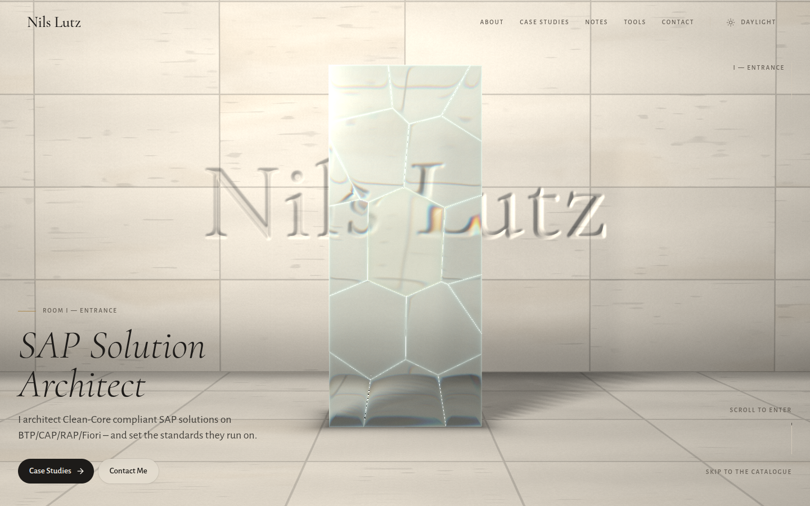
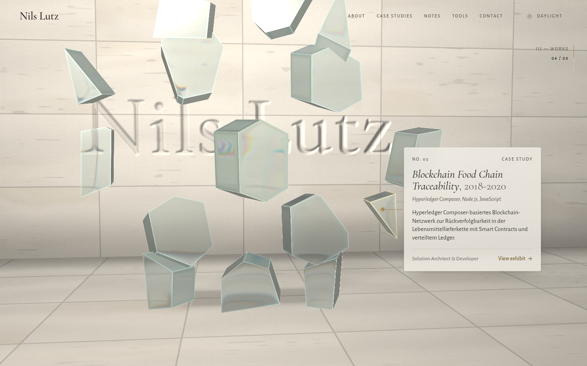
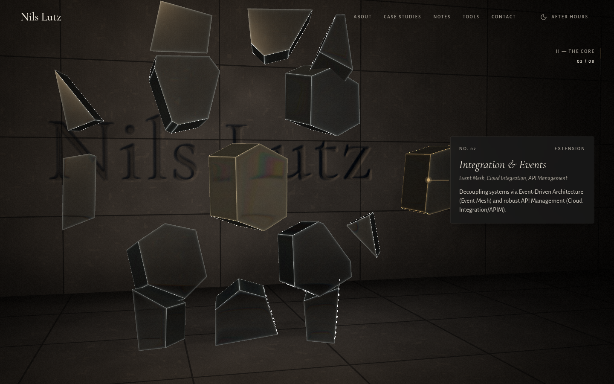
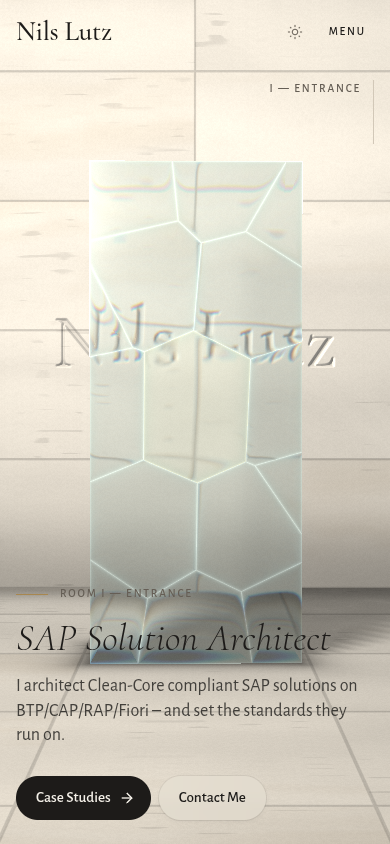

# Monolith — a silent gallery

One of five redesign proposals for nilslutz.de. Branch: `redesign/monolith`.

## Concept

The site is set up as a quiet museum room. The home page is an exhibition in four rooms. Each service
and case study hangs as an exhibit with a wall label. Nothing shouts. The mood comes from light, material
and a slow pace.

- **Mood:** museum calm, architectural, stone and glass. Warm travertine by day ("Daylight"), dark
  basalt with one warm light pool "After hours" (dark mode). A little brushed brass for rules, pins
  and the exhibit that has focus.
- **Type:** _Cormorant_ (a refined, high-contrast display face, often set in italics like a title on a
  label) with _Alegreya Sans_ (a quiet humanist sans for body text). Small-caps labels are tracked out
  like museum wall labels: `No. 03 — Case study`, then title and date, then medium in italics, then
  credit.

## The memorable thing

A **glass monolith rendered in Three.js** stands in a softly lit stone room. The wordmark "Nils Lutz" is
carved into the back wall, and you see it **distorted through the glass**.

- Custom refraction shader: the room is drawn into a mip-mapped render target first. The glass then
  samples it in screen space with 6 IOR taps spread over R→G→B, which gives chromatic dispersion. It
  also has Fresnel reflection of an imaginary gallery, Beer–Lambert absorption (grazing faces and bevels
  go cool grey-green), polished edge lines, a slow cast-glass waviness and an inner, caustic-like glint
  toward the light.
- The carved wordmark is a height field built from a blurred canvas mask and lit by grazing light. The
  floor gets a 36-tap soft point-light shadow and a contact shadow. Wall and floor both show a caustic
  web where the glass shadow falls.
- The pointer (touch on phones, device tilt where available) moves the light around the object and
  turns it gently. The object "breathes" with a very small vertical scale. On page load the light sweeps
  in and the exposure rises. That is the one orchestrated entrance, together with a staggered wall label
  and SplitText line reveal.

## Scroll story (pinned, scrubbed)

A sticky 1200svh section. Scroll progress is damped once and shared by the camera, the shards and the
DOM labels (`story.ts`), so they stay in lock-step.

| Room            | Progress  | What happens                                                                                                                                                                                                                                                         |
| --------------- | --------- | -------------------------------------------------------------------------------------------------------------------------------------------------------------------------------------------------------------------------------------------------------------------- |
| I — Entrance    | 0 – 0.08  | Intact monolith, title label, CTAs                                                                                                                                                                                                                                   |
| II — The Core   | 0.1 – 0.4 | The slab fractures along a Voronoi pattern (`fracture.ts`). The **Clean Core** cell stays in the centre, glows faintly brass and never moves. Extension shards drift outward. Exhibits 00–02 are the three disciplines (Core, BTP Extensions, Integration & Events). |
| III — Works     | 0.4 – 0.8 | The camera orbits across the shards. Each exhibit label is pinned to its shard with a brass lead line, and the focused shard comes forward. Exhibits 03–07 are case studies.                                                                                         |
| IV — Reassembly | 0.84 – 1  | The shards reassemble, the camera pulls back and to the side, and the correspondence plate (email / contact) appears                                                                                                                                                 |

After the story come the catalogue of works (a numbered list), a wall text on Enterprise Pragmatism
with principles and materials, and a reading room with recent notes. Wall texts use SplitText masked
line reveals, triggered once.

Inner pages (/about, /work, /work/[slug], /notes, /notes/[slug], /tools, /contact, legal pages) use the
same language: room-numbered labels, display titles, a "plinth" card for case-study metadata, vitrine
sections on /tools, and readable MDX prose with Shiki highlighting (including the custom cds/abapcds
grammars).

| Exhibit                         | After hours                             | Mobile                     |
| ------------------------------- | --------------------------------------- | -------------------------- |
|  |  |  |

## Tech notes

- **Stack:** Three.js (raw, no R3F) with hand-written GLSL (`components/specialized/monolith/`), GSAP
  ScrollTrigger and SplitText, Lenis driven from `gsap.ticker` (lag smoothing off). The WebGL frame
  renders from the same ticker. Motion (`motion/react`) is used for small UI pieces.
- **Render pipeline:** room → half-float render target with mipmaps. Glass shards plus a copy of the room
  → MSAA target (desktop). Post pass → vignette, grain and exposure.
- **Performance:** DPR is capped at 1.5 on mobile/coarse pointers and 2 on desktop. Mobile gets a smaller
  wordmark texture and no MSAA. Rendering pauses when the section is offscreen (IntersectionObserver) or
  the tab is hidden. The scene module is loaded with a dynamic import and fully disposed on unmount.
- **Reduced motion:** no Lenis and no pin. A single static WebGL frame; the exhibits and contact become a
  normal readable grid.
- **No WebGL:** a CSS poster (carved wordmark plus a frosted glass slab) stays in place, and the
  exhibits fall back to stacked cards.
- **Dependencies:** added `gsap`, `lenis`, `motion`, `three` (+ `@types/three`). Removed `framer-motion`,
  `@tsparticles/*`, `rehype-highlight`, `@radix-ui/react-slot`, `class-variance-authority`.
- **Tests:** unit tests for the fracture geometry and the story timeline. The E2E port can be set with
  `PORT=… npm run test:e2e`, and a preinstalled Chromium with `PW_CHROMIUM_PATH`.

## Known limits

- **Rive is not used.** None of the MIT sample `.riv` files available (button, rating, vehicles, etc.)
  fits a silent-gallery concept, and a mismatched animation would weaken it.
- Screenshots come from headless SwiftShader. Real GPUs render with MSAA and at full frame rate.
- On phones the fractured state is dense because the frame is narrow. Labels are docked to the bottom
  instead of pinned to their shards.
- Refraction is screen-space: shards refract the room but not each other.
