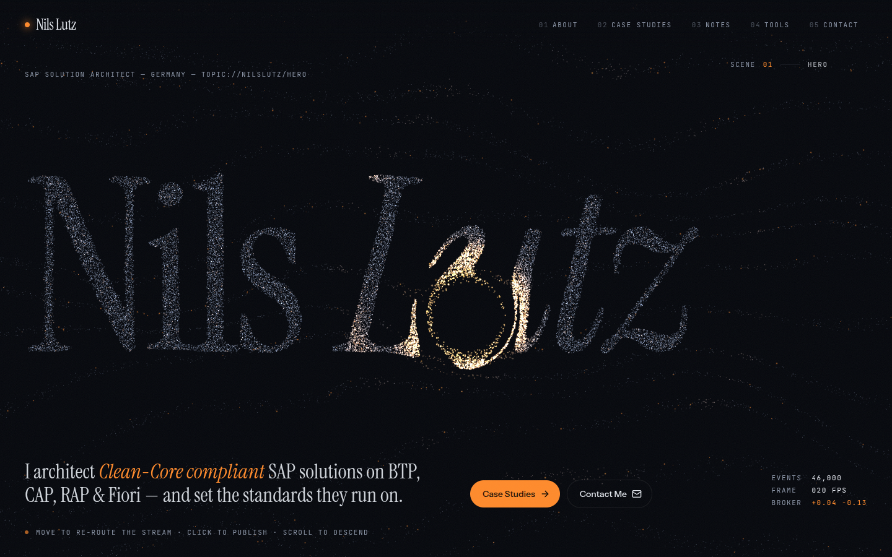
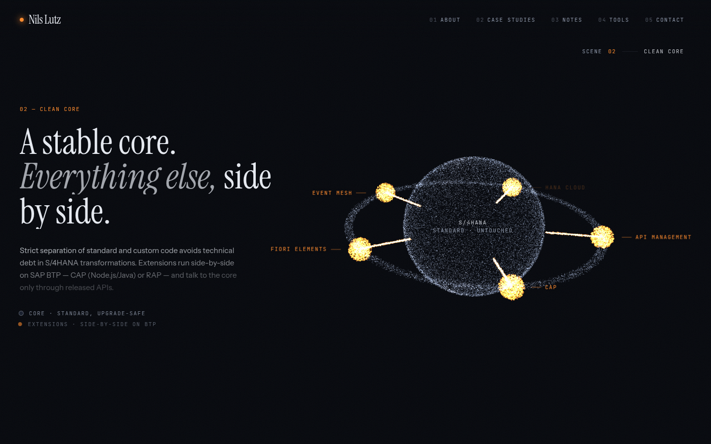
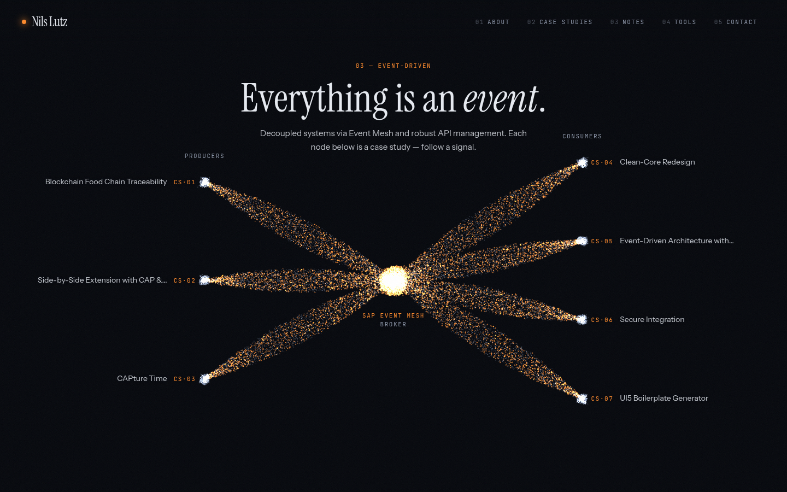
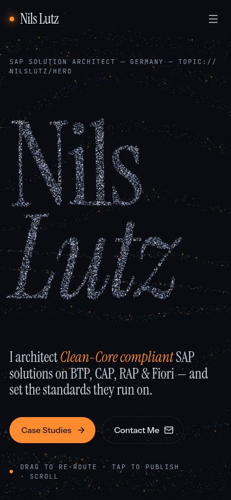

# Signal: redesign proposal

Branch: `redesign/signal`

## Concept

A control room or observatory at night. The site reads like a monitoring wall for an event-driven landscape. Events
move along topic channels, a broker re-routes them, and diagrams take shape out of the traffic. The layout draws on
Nils' own architecture themes: Clean Core, side-by-side extensions, and Event Mesh.

- **Mood:** dark ink-blue-black (`#05070c`), cool hairline greys, and sodium-vapour orange (`#ff8a2b`) as the only
  accent. The site is dark-only, so the theme toggle and `next-themes` were removed.
- **Type:** a large, condensed display serif for the wordmark and headings (italic for emphasis), paired with a
  precise uppercase monospace for labels, HUD readouts and metadata. Body text uses a quiet grotesk. Numbers use
  `tabular-nums`, headings use `text-wrap: balance` and body text uses `pretty`.

## The one memorable thing: the event mesh hero

About 46k GPU particles on desktop (18k on phones) travel as "events" along 13 invisible topic lanes, bent by an
analytic curl-noise field. On load they converge into the wordmark **Nils Lutz**. The wordmark is sampled from the
real DOM heading, so it uses the same font at the same position. The pointer or finger acts as the **broker**: it
deflects and swirls the stream, and the re-routed events glow sodium orange. A click or tap publishes a pub/sub
pulse that ripples outward. The broker lets go of the stream when the pointer is idle, so a parked mouse never leaves
a hole in the stream.

## Scene list (home)

1. **Hero:** one orchestrated page load. The eyebrow types in character by character (SplitText), the particles
   converge into the wordmark, the tagline rises through a line mask, and the CTAs and HUD readouts (event count,
   fps, broker coordinates) fade in.
2. **Clean Core (pinned, scrubbed):** the particles re-form into a stable, slowly rotating S/4HANA sphere. Five
   side-by-side extensions (CAP, Fiori Elements, Event Mesh, HANA Cloud, API Management) orbit outside it, and
   "released API" traffic runs only from the satellites to the core surface. HTML labels follow the 3D satellites
   and dim when a satellite passes behind the core. On phones they collapse into a legend line.
3. **Topology (pinned, scrubbed):** producers → SAP Event Mesh broker → consumers. Each node is a real case study
   and links to it. The events travel the edges as curved streams. The heading enters as 3D-rotated SplitText
   characters.
4. **Starfield:** the mesh dissolves into a calm, twinkling, drifting starfield behind the reading content: case
   files, field notes, and the "Let's route the next signal" contact block. The HUD fades out here.

Inner pages (about, work, notes, tools, contact, legal) use the same language: mono eyebrow codes, serif headings,
hairline dividers, and shadow-based surfaces. MDX prose uses a dark `vesper` shiki theme, and the custom `cds` /
`abapcds` grammars are unchanged.

## Tech notes

- `components/specialized/signal/event-mesh.ts`: Three.js `Points` with a custom `ShaderMaterial`. Every particle
  stores four destinations (flow/text, core, topology, star). The vertex shader blends them with per-particle
  staggered progress. There is no GPGPU ping-pong because the curl field is stateless.
- `components/specialized/signal/shaders.ts`: the GLSL.
- `lib/signal-layout.ts`: the layout math shared by GLSL and the HTML label overlay (unit-tested).
- `components/specialized/signal/home-experience.tsx`: GSAP timelines, ScrollTrigger pins and scrubs, SplitText,
  pointer and touch input, and the HUD.
- `components/ui/smooth-scroll.tsx`: Lenis driven from `gsap.ticker`. The WebGL frame renders from the same ticker.
- Performance: DPR is capped at 1.5 on mobile and 2 on desktop, phones get fewer particles, rendering stops while
  the tab is hidden, and the canvas is disposed (with forced context loss) on unmount. The mesh is imported
  dynamically on the client only. Without WebGL, the page falls back to the solid serif wordmark and an animated
  entrance of the type.
- Reduced motion: Lenis, scrubbing and the intro are off. The mesh renders single static frames: each diagram holds
  still under a plain pin while its copy is read, and the calm starfield fills the gaps between scenes.
- Dependencies added: `gsap`, `lenis`, `motion`, `three` (+ `@types/three`). Removed: `framer-motion` (replaced by
  `motion`), `next-themes`, `@tsparticles/*`, `@radix-ui/react-slot`, `class-variance-authority` and
  `rehype-highlight`.
- Rive: skipped. The MIT `.riv` samples that were available (button, coyote, rocket, vehicles and others) do not
  fit a control-room concept, and adding one only for its own sake would weaken the design.

## Known limits

- The headless screenshots use SwiftShader at about 20 fps. Real GPUs run the ~46k points comfortably, but very old
  phones may drop frames during scrubbed transitions.
- Satellite labels on phones are replaced by a legend line, because the tilted orbit is too narrow for tracked
  labels.
- The fixed canvas also renders behind the reading sections (as a starfield). This costs a little GPU while
  reading.
- `CLAUDE.md` still describes the previous stack (framer-motion, next-themes). Update it if this proposal is chosen.

## Screenshots

| Desktop: Clean Core                         | Desktop: Topology                       | Mobile: Hero                    |
| ------------------------------------------- | --------------------------------------- | ------------------------------- |
|  |  |  |
