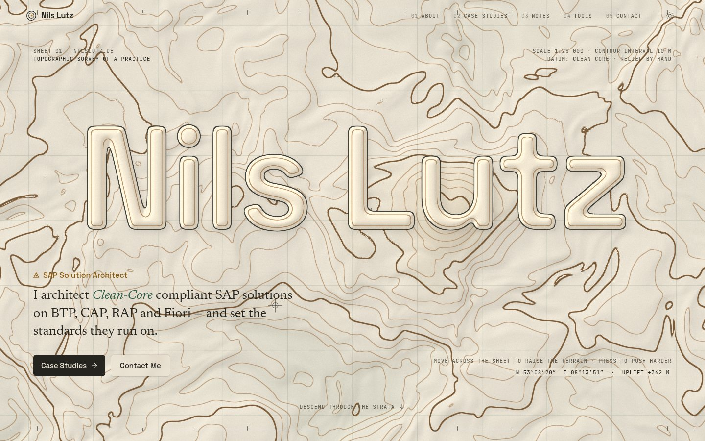
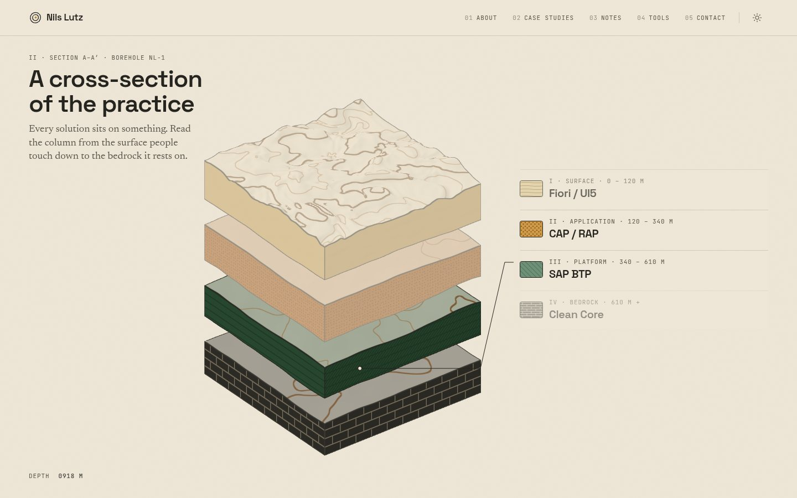
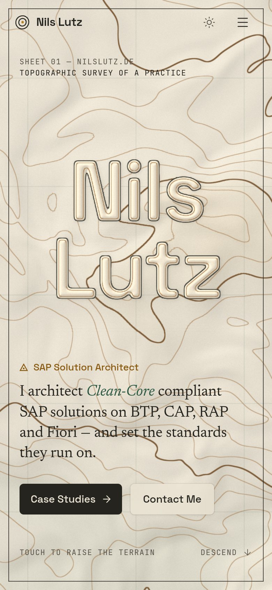
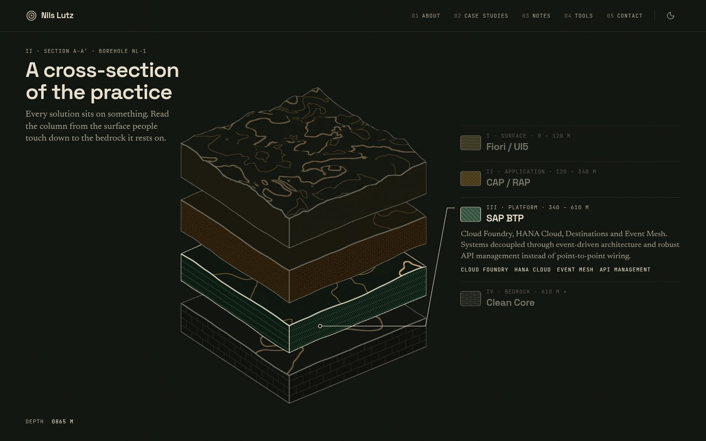

# Strata — redesign proposal

Branch: `redesign/strata`

## Concept

The site is a **printed geological survey sheet**. It borrows from Swiss topographic maps and
geological survey plates: warm uncoated paper, graphite ink, ochre and a deep survey green,
contour lines, neatlines, graticule ticks, marginalia in a technical mono, coordinates, and
lithology patterns. The story matches how Nils describes his work: every solution sits on
layers, and the Clean Core is the bedrock underneath them.

- **Mood:** calm, precise and tactile. It should read like a well-made printed object, not a tech demo.
- **Type:** Space Grotesk for display and UI (technical grotesk), Newsreader for reading text
  (serif, optical sizes), JetBrains Mono for marginalia, coordinates and readouts (tabular numbers).
- **Palette:** paper `#eee7d8`, graphite ink, contour brown, ochre and survey green, each with a dark-mode
  "night plate" counterpart (tokens live in `app/globals.css`).

## The memorable thing

The hero is **living terrain**: a full-screen fragment shader of domain-warped fBm drawn as
contour lines. The lines are anti-aliased with `fwidth`, every fifth line is a heavier index contour,
the relief carries a hillshade lit from the north-west, and a kilometre grid sits on top. The
cursor, or a finger on touch screens, **pushes a mountain up from below**. Pressing pushes harder,
and a live readout shows coordinates and uplift. When nobody touches the sheet, a slow survey drone
wanders it instead.

The wordmark **"Nils Lutz" is embossed into the terrain as a plateau**. The glyphs are rasterised
into a two-channel ramp: a tight ramp gives an anti-aliased outline, a bevel lit from the NW and an
inset plateau contour, and a wide ramp raises the terrain into the letters' footings. Contours crowd
around the letters like an escarpment and stop at the cliff edge.

## Scene list (home)

1. **Sheet 01, Terrain hero.** One orchestrated page load: the neatline draws in, the terrain rises
   (uRise), the plateau emerges (uWordAmt), then the marginalia, role, tagline lines (SplitText) and
   actions stagger in.
2. **II, Section A–A′ (pinned, scrubbed).** The map sheet starts full-bleed, then tilts into a 3D
   block diagram and separates stratum by stratum: _I Surface: Fiori / UI5 → II Application:
   CAP / RAP → III Platform: SAP BTP → IV Bedrock: Clean Core_. Each stratum has its own lithology
   (laminae, stipple, shale hatching, limestone blocks). A survey leader line connects the active
   layer to its annotation, and a depth readout counts down in metres.
3. **Sheet 03, Survey register.** Case studies as numbered survey points (SP 01…) with pseudo-grid
   coordinates on a live contour map. The active row pushes its point up as a summit.
4. **IV, Field journal.** Notes as dated, numbered entries in a ledger. An ochre margin rule is
   drawn by the reader's scroll.
5. **Base camp.** A contact call to action with concentric contour rings. The footer carries a map
   legend and a scale bar.

A borehole **depth gauge** on the right margin tracks scroll depth across the whole home page.
Inner pages (`/about`, `/work`, `/work/[slug]`, `/notes`, `/notes/[slug]`, `/tools`, `/contact`, and the
legal pages) share a "sheet header" with a survey grid, sheet numbers and marginalia. MDX prose uses
the reading serif, and shiki code blocks (including the `cds` / `abapcds` grammars) sit on paper cards.

## Tech notes

- **Three.js** raw `WebGLRenderer` + `ShaderMaterial`, with no R3F. `components/webgl/terrain-canvas.tsx`
  renders the hero and the register map, and `components/webgl/strata-block.ts` renders the block
  diagram. Shared GLSL (gradient noise, fBm, AA iso-lines) lives in `lib/glsl.ts`. Palette colours
  are read from CSS tokens, so theme switches recolour the shaders live.
- **Lenis** is driven from `gsap.ticker` (`lenis.on('scroll', ScrollTrigger.update)`,
  `lagSmoothing(0)`). **Every WebGL frame renders from the same ticker**, so scroll, pins and
  shaders advance together.
- **GSAP**: ScrollTrigger (pin + scrub for the strata scene, register, depth gauge, margin rule) and
  SplitText for the hero tagline.
- **Motion** (`motion/react`) handles micro-interactions: icon swaps (spring, bounce 0), the mobile menu
  and the case-study filter layout. Framer Motion and tsparticles were removed.
- **Performance and robustness**: canvases are client-only (`dynamic(..., { ssr: false })` or an effect
  with a dynamic import) and dispose on unmount. DPR is capped at 1.5 on coarse pointers and 2 on
  desktop, and the terrain scale is lower on mobile. Adaptive resolution drops the pixel ratio when
  frames are slow. Rendering pauses when offscreen (IntersectionObserver) or when the tab is hidden,
  and renders are on-demand (dirty flag) outside the animated hero. If WebGL is unavailable, the page
  falls back to a static terrain poster (`public/strata/hero-poster.webp`) with a real HTML `<h1>`,
  and to CSS lithology swatches for the strata.
- **Reduced motion**: no Lenis, no pins or scrub, and the hero is a static relief (the terrain
  still reacts to the pointer directly, without easing). The block diagram is shown fully
  separated, and all annotations are expanded.
- **Polish** (make-interfaces-feel-better): tabular numbers on every readout, `text-wrap`
  balance and pretty, antialiased text, layered shadows instead of borders on surfaces, 0.96
  scale on press, 44px hit areas, no `transition: all`, one staggered entrance only (the hero).
- MDX body `# headings` render as `<h2>`, so each page has exactly one `<h1>` (the entry title).

## Rive

Skipped. The available MIT `.riv` files (button, coyote, liquid download, little machine,
rating, rocket, skills, vehicles) are all cartoon or UI-kit pieces. None of them fits the
printed-survey language, and forcing one in would have cheapened the concept, so
`@rive-app/react-canvas` was removed.

## Known limits

- The shaders are tuned on SwiftShader (headless) screenshots. On a real GPU the hero runs smoothly,
  but very old mobile GPUs will fall back to the adaptive lower pixel ratio.
- The strata scene's legend follows the smoothed scroll progress. On a very slow main thread
  (for example headless software GL) the highlighted annotation can visibly trail the leader line.
- The survey-point coordinates are decorative grid references, not real locations.
- `content/notes/dependency-injection-cap.mdx` contains a pre-existing U+FFFD character
  ("Zirkul�re"). Content was left untouched.

