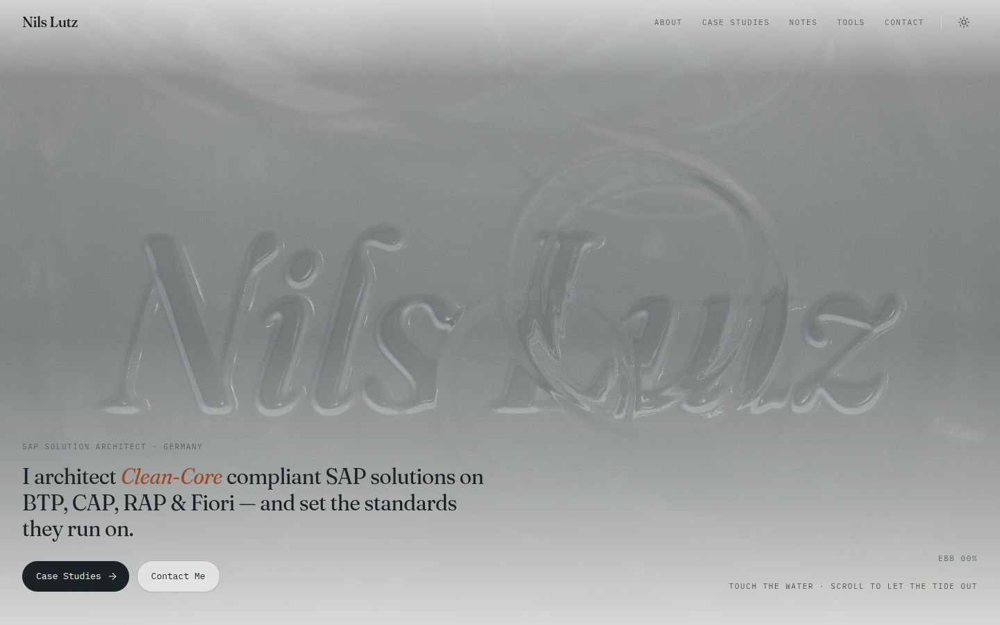
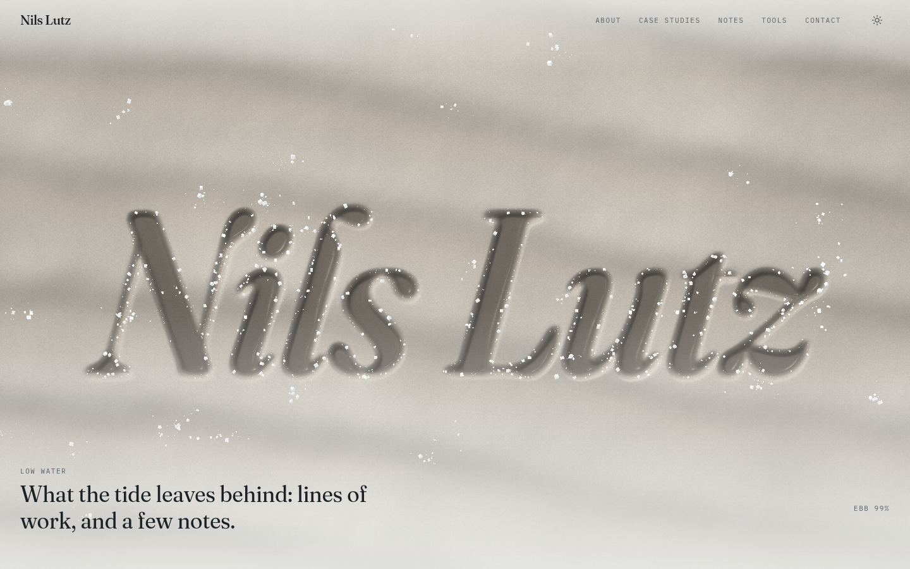
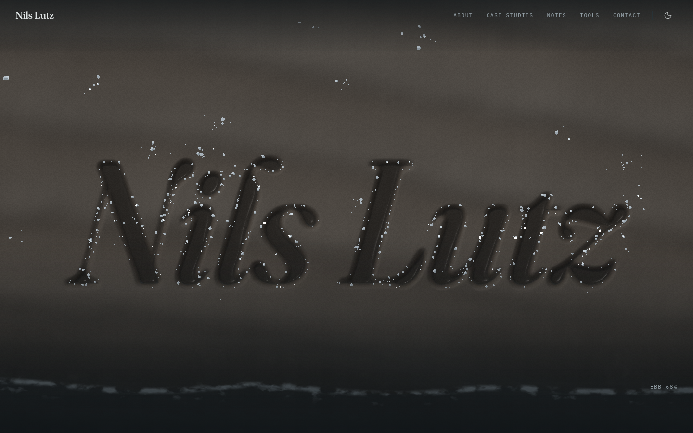
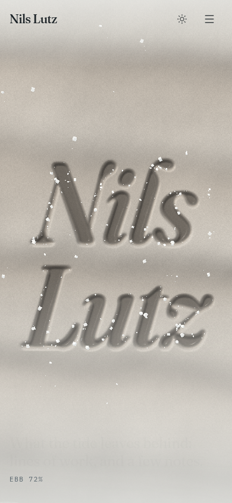

# Tide — redesign proposal

Quiet, tidal, tactile. Grey Atlantic light, not beach kitsch.

## Concept & mood

An overcast North Atlantic tidal flat. The page is a walk from high water to low water: first you see the name
through moving water, then the tide drains away and leaves behind what it always leaves, which is lines, marks and
things washed up. Calm, patient, precise. That is how an architect who writes "Enterprise Pragmatism" should feel.

- **Palette**: salt white `#eef0ee`, cold slates (`#1b2226`, `#55616a`), wet clay (`#a8998a` / `#6f6254`), one muted
  oxide accent `#9a4a2c` (dark theme: `#0f1417` night water, oxide `#d0805d`). Tokens live in `app/globals.css`.
- **Type**: one serif family, **Fraunces** (variable `opsz` / `SOFT` / `WONK`). The display cut (opsz 144, light) is
  used for headlines and the italic wordmark carved into the clay; the headline and text cuts are used for everything
  else. **IBM Plex Mono** handles eyebrows, dates, tags and controls, like a tide table.

## The memorable thing

**The hero is water.** A real-time GPU height-field ripple simulation fills the screen. The wordmark "Nils Lutz"
is carved into a procedural clay bed _under_ the surface and refracts through it. Cursor movement or a finger drags
ripples through the water; a tap drops a stone. Scrolling (scrubbed and pinned) drains the tide: a foamy waterline
slides down over the letters, the wet clay darkens and then dries, and instanced salt crystals grow on the drying
flat, clustering along the rims of the carved letters and glinting near the pointer.

## Scenes (home)

1. **High water → low water** (hero, pinned 180%, scrubbed): water sim + refraction, Fresnel reflection of an overcast
   sky with slow cloud banks, soft specular, laplacian caustics. The tide level, the drying of the clay and the salt
   growth are driven by scroll. An `Ebb 00–100%` gauge reads out the tide. This is the one orchestrated page load:
   the water settles in from paper, two drops land, then the copy arrives (SplitText line masks, ~100 ms stagger).
2. **Tide lines** (pinned, scrubbed): every case study is a wrack line, the mark a high water leaves. Lines are drawn
   one by one (most recent first) with salt grains settling on them. A large "high water" readout shows the period of
   the line currently being laid down.
3. **Currents**: the bio surfaces word by word as it scrolls through (scrubbed opacity). The three practices read
   like a tide table, with rules that draw in.
4. **Left by the tide** (pinned, horizontal): notes are specimen tags washed up on the flat; they settle from a
   tilt as they drift past the center.
5. **Signal**: "Before the water comes back in." Contact CTAs and availability, plus a small Rive lighthouse whose
   switch toggles day tide / night tide (the site theme).

Inner pages (/about, /work, /work/[slug], /notes, /notes/[slug], /tools, /contact, legal) use the same language:
Fraunces display headers, mono eyebrows, hairline structure, wavy tide-line dividers and card surfaces made with
shadows instead of borders. MDX prose is set in a readable measure with Shiki/rehype-pretty-code highlighting, including
the custom `cds` / `abapcds` grammars.

## Tech notes

- **Water**: `components/specialized/tide/tide-engine.ts` (three.js, no React) and `shaders.ts`. Ping-pong half-float
  render targets hold height and velocity. Each frame runs drop → update ×2 → normals, followed by a composite pass
  that refracts a baked clay texture (height, normals and letter mask in half-float, baked once per resize) and adds
  Fresnel/sky/specular and foam. Salt is an `InstancedMesh` of tiny cubes whose growth is computed in the vertex
  shader from the same waterline function as the composite.
- **One clock**: Lenis is driven from `gsap.ticker` (`lenis.on('scroll', ScrollTrigger.update)`, `lagSmoothing(0)`),
  and the WebGL frame renders from the same ticker. The hero pin is created synchronously so later pins measure after
  it.
- **Budget**: DPR capped at 1.5 on mobile and 2 on desktop, and adaptively lowered when frames run slow. The
  simulation is 150 rows on mobile and 240 on desktop. Rendering stops when the hero is offscreen (per-tick rect
  check; IntersectionObserver is unreliable once the pin reparents the section) or when the tab is hidden.
  Everything is disposed on unmount.
- **Fallbacks**: without WebGL, a static clay-to-slate gradient with the name set in type is shown. Without float
  render targets, the carved clay still renders but without ripples. The engine is dynamically imported and
  client-only.
- **Reduced motion**: no Lenis, no pins or scrubs, one calm static frame (tide half out, a little salt), and all
  content in normal flow.
- **Rive**: `public/rive/lighthouse.riv` is the MIT-licensed `switch_event_example.riv` from rive-app/rive-react, and
  the runtime wasm is self-hosted because the default CDN isn't reachable everywhere. Both are listed in
  `public/rive/LICENSE.txt`. The component only mounts when it nears the viewport, so the ~1.9 MB wasm isn't paid for
  up front. The `<button>` wrapper is the accessible control, and the canvas is decorative.
- **Content headings**: MDX files start with `# Title`, which repeated the page's `<h1>`. The renderer drops that
  leading line and demotes any other `#` heading to `<h2>` (`stripLeadingTitle` in `lib/utils.ts`, unit-tested).
- **Deps**: added `gsap`, `lenis`, `three` (+ `@types/three`), `motion`, `@rive-app/react-canvas`; removed
  `framer-motion`, `@tsparticles/*`, `@radix-ui/react-slot`, `class-variance-authority`, `rehype-highlight`, plus the
  typewriter/particle components.

## Known limits

- The simulation needs `EXT_color_buffer_(half_)float`; without it the hero is a static clay frame (the name is still
  carved, just without ripples).
- Headless/software GL (SwiftShader) runs at a few fps. Screenshots were taken there; real GPUs are needed to judge
  the motion.
- The Rive lighthouse is a stock example in a flat illustrative style, desaturated to sit in the palette. A bespoke
  animation in the site's own line language would fit better.
- On very short landscape phones, the pinned hero copy and the low-water caption can sit close to each other.
